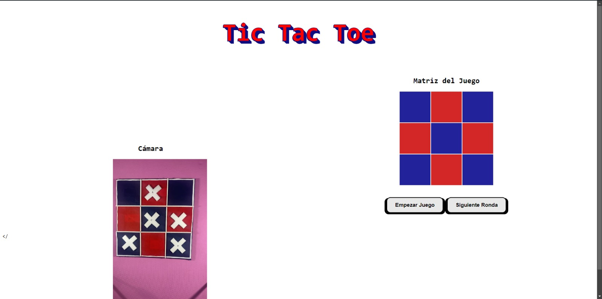

# 👋 ¡Hola! Soy Annabella Sánchez

Bienvenido a mi repositorio personal. Soy una entusiasta de la ciencia de datos y el desarrollo web.  
Aquí encontrarás una colección de proyectos personales, colaborativos y académicos que reflejan mi crecimiento profesional.

---

## 🚀 Proyectos Destacados

### 🎮 Sistema de Ayuda de Mesa con Visión por Computadora
- **Descripción**  
  Un Tic Tac Toe que utiliza la cámara para controlar el juego vía detección de movimiento, con IA Minimax.
- **Tecnologías**  
  `Python`, `OpenCV`, `Flask`
- **Estado**  
  🛠️ Mejorando la interfaz :)
- **Repositorio**  
  [github.com/Jmuniz27/ProyectoMatDisc--Tic-Tac-Toe-With-Trees](https://github.com/Jmuniz27/ProyectoMatDisc--Tic-Tac-Toe-With-Trees)
- **Captura**  
  

---

## 💡 Sobre Mí

Soy estudiante apasionada por la tecnología, la ciencia de datos y la educación.  
Me encanta trabajar en proyectos que combinen creatividad y utilidad social.

- 🌱 **Actualmente aprendiendo:** BI, React  
- 🧠 **Intereses:** Visualización de datos, ML interpretability, front-end  
- 📫 **Contáctame:** [LinkedIn](https://linkedin.com/in/annabellasanchez) · [✉️ Email](mailto:tu.email@ejemplo.com)

---

## 🧰 Tecnologías y Herramientas

| Lenguajes       | Frameworks          | BI & Análisis   | Control de versiones | Cloud & Automatización |
|-----------------|---------------------|-----------------|----------------------|------------------------|
| Python · Java · SQL | Matplotlib · React (básico) | Pandas · Spark | Git · GitHub         | Databricks             |

---

